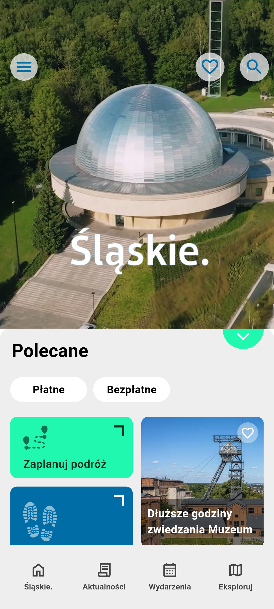

# Fyrtel
Mobile app to see what's happening in your area.

## Description 
The purpose of the application is to inform about events in your area. It allows you to display a list of articles in the way you like (both vertically and horizontally). 
You can filter it by paid or free and add selected articles to your favourites.

Application layouts
*  Home page - portrait,

*  Home page - landscape,

## Tools
* Dart 3.4.3
* Flutter 3.22.2

### Packages
  \# multimedia
  * video_player: ^2.9.2
  * flutter_svg: ^2.0.14
  * material_symbols_icons: ^4.2789.0

  \# state management
  * bloc: ^8.1.4
  * flutter_bloc: ^8.1.6
  * bloc_test: ^9.1.7

  \# DI
  * get_it: ^7.2.0
  * injectable: ^2.1.0

  \# storage
  * hive: ^2.2.3
  * hive_flutter: ^1.1.0

  \# other
  * json_annotation: ^4.9.0
  * freezed_annotation: ^2.4.1
  * alchemist: ^0.10.0

## How to run
* Download and build project
* install fyrtel.apk

## Future improvements
* Adding navigation
* Adding news, events and explore pages
* Adding search feature

## Author
**Michał Popiel** - [ReQezeR](https://github.com/ReQezeR)
